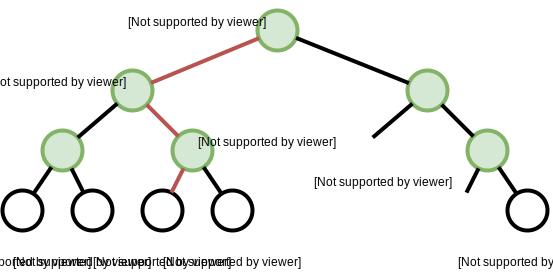

# 词向量：word2vec

自然语言是一套用来表达含义的复杂系统。在这套系统中，词是表义的基本单元。在机器学习中，如何使用向量表示词？

顾名思义，词向量是用来表示词的向量，通常也被认为是词的特征向量。近年来，词向量已逐渐成为自然语言处理的基础知识。

## 为何不采用one-hot向量

我们在[循环神经网络](../chapter_recurrent-neural-networks/rnn-scratch.md)中介绍过one-hot向量来表示词。假设词典中不同词的数量为$N$，每个词可以和从0到$N-1$的连续整数一一对应。假设一个词的相应整数表示为$i$，为了得到该词的one-hot向量表示，我们创建一个全0的长为$N$的向量，并将其第$i$位设成1。

然而，使用one-hot词向量并不是一个好选择。一个主要的原因是，one-hot词向量无法表达不同词之间的相似度。例如，任何一对词的one-hot向量的余弦相似度都为0。

## word2vec

2013年，Google团队发表了[word2vec](https://code.google.com/archive/p/word2vec/)工具。word2vec工具主要包含两个模型：跳字模型（skip-gram）和连续词袋模型（continuous bag of words，简称CBOW），以及两种高效训练的方法：负采样（negative sampling）和层序softmax（hierarchical softmax）。值得一提的是，word2vec词向量可以较好地表达不同词之间的相似和类比关系。

word2vec自提出后被广泛应用在自然语言处理任务中。它的模型和训练方法也启发了很多后续的词向量模型。本节将重点介绍word2vec的模型和训练方法。

## 模型

### 跳字模型

在跳字模型中，我们用一个词来预测它在文本序列周围的词。例如，给定文本序列"the", "man", "hit", "his", 和"son"，跳字模型所关心的是，给定"hit"，生成它邻近词“the”, "man", "his", 和"son"的概率。在这个例子中，"hit"叫中心词，“the”, "man", "his", 和"son"叫背景词。由于"hit"只生成与它距离不超过2的背景词，该时间窗口的大小为2。

我们来描述一下跳字模型。

假设词典大小为$|\mathcal{V}|$，我们将词典中的每个词与从0到$|\mathcal{V}|-1$的整数一一对应：词典索引集$\mathcal{V} = \{0, 1, \ldots, |\mathcal{V}|-1\}$。一个词在该词典中所对应的整数称为词的索引。给定一个长度为$T$的文本序列中，$t$时刻的词为$w^{(t)}$。当时间窗口大小为$m$时，跳字模型需要最大化给定任一中心词生成背景词的概率：

$$ \prod_{t=1}^T \prod_{-m \leq j \leq m, j \neq 0} \mathbb{P}(w^{(t+j)} \mid w^{(t)})$$

上式的最大似然估计与最小化以下损失函数等价

$$ -\frac{1}{T} \sum_{t=1}^T \sum_{-m \leq j \leq m, j \neq 0} \text{log} \mathbb{P}(w^{(t+j)} \mid w^{(t)})$$

我们可以用$\mathbf{v}$和$\mathbf{u}$分别代表中心词和背景词的向量。换言之，对于词典中一个索引为$i$的词，它在作为中心词和背景词时的向量表示分别是$\mathbf{v}_i$和$\mathbf{u}_i$。而词典中所有词的这两种向量正是跳字模型所要学习的模型参数。为了将模型参数植入损失函数，我们需要使用模型参数表达损失函数中的中心词生成背景词的概率。假设中心词生成各个背景词的概率是相互独立的。给定中心词$w_c$在词典中索引为$c$，背景词$w_o$在词典中索引为$o$，损失函数中的中心词生成背景词的概率可以使用softmax函数定义为

$$\mathbb{P}(w_o \mid w_c) = \frac{\text{exp}(\mathbf{u}_o^\top \mathbf{v}_c)}{ \sum_{i \in \mathcal{V}} \text{exp}(\mathbf{u}_i^\top \mathbf{v}_c)}$$

当序列长度$T$较大时，我们通常随机采样一个较小的子序列来计算损失函数并使用[随机梯度下降](../chapter_optimization/gd-sgd-scratch.md)优化该损失函数。通过微分，我们可以计算出上式生成概率的对数关于中心词向量$\mathbf{v}_c$的梯度为：

$$\frac{\partial \text{log} \mathbb{P}(w_o \mid w_c)}{\partial \mathbf{v}_c} = \mathbf{u}_o - \sum_{j \in \mathcal{V}} \frac{\text{exp}(\mathbf{u}_j^\top \mathbf{v}_c)}{ \sum_{i \in \mathcal{V}} \text{exp}(\mathbf{u}_i^\top \mathbf{v}_c)} \mathbf{u}_j$$

而上式与下式等价：

$$\frac{\partial \text{log} \mathbb{P}(w_o \mid w_c)}{\partial \mathbf{v}_c} = \mathbf{u}_o - \sum_{j \in \mathcal{V}} \mathbb{P}(w_j \mid w_c) \mathbf{u}_j$$

通过上面计算得到梯度后，我们可以使用[随机梯度下降](../chapter_optimization/gd-sgd-scratch.md)来不断迭代模型参数$\mathbf{v}_c$。其他模型参数$\mathbf{u}_o$的迭代方式同理可得。最终，对于词典中的任一索引为$i$的词，我们均得到该词作为中心词和背景词的两组词向量$\mathbf{v}_i$和$\mathbf{u}_i$。

### 连续词袋模型

连续词袋模型与跳字模型类似。与跳字模型最大的不同是，连续词袋模型中用一个中心词在文本序列周围的词来预测该中心词。例如，给定文本序列"the", "man", "hit", "his", 和"son"，连续词袋模型所关心的是，邻近词“the”, "man", "his", 和"son"一起生成中心词"hit"的概率。

假设词典大小为$|\mathcal{V}|$，我们将词典中的每个词与从0到$|\mathcal{V}|-1$的整数一一对应：词典索引集$\mathcal{V} = \{0, 1, \ldots, |\mathcal{V}|-1\}$。一个词在该词典中所对应的整数称为词的索引。给定一个长度为$T$的文本序列中，$t$时刻的词为$w^{(t)}$。当时间窗口大小为$m$时，连续词袋模型需要最大化由背景词生成任一中心词的概率：

$$ \prod_{t=1}^T  \mathbb{P}(w^{(t)} \mid  w^{(t-m)}, \ldots,  w^{(t-1)},  w^{(t+1)}, \ldots,  w^{(t+m)})$$

上式的最大似然估计与最小化以下损失函数等价

$$  -\sum_{t=1}^T  \text{log} \mathbb{P}(w^{(t)} \mid  w^{(t-m)}, \ldots,  w^{(t-1)},  w^{(t+1)}, \ldots,  w^{(t+m)})$$

我们可以用$\mathbf{v}$和$\mathbf{u}$分别代表背景词和中心词的向量（注意符号和跳字模型中的不同）。换言之，对于词典中一个索引为$i$的词，它在作为背景词和中心词时的向量表示分别是$\mathbf{v}_i$和$\mathbf{u}_i$。而词典中所有词的这两种向量正是连续词袋模型所要学习的模型参数。为了将模型参数植入损失函数，我们需要使用模型参数表达损失函数中的中心词生成背景词的概率。给定中心词$w_c$在词典中索引为$c$，背景词$w_{o_1}, \ldots, w_{o_{2m}}$在词典中索引为$o_1, \ldots, o_{2m}$，损失函数中的背景词生成中心词的概率可以使用softmax函数定义为

$$\mathbb{P}(w_c \mid w_{o_1}, \ldots, w_{o_{2m}}) = \frac{\text{exp}[\mathbf{u}_c^\top (\mathbf{v}_{o_1} + \ldots + \mathbf{v}_{o_{2m}}) /(2m) ]}{ \sum_{i \in \mathcal{V}} \text{exp}[\mathbf{u}_i^\top (\mathbf{v}_{o_1} + \ldots + \mathbf{v}_{o_{2m}}) /(2m)]}$$

当序列长度$T$较大时，我们通常随机采样一个较小的子序列来计算损失函数并使用[随机梯度下降](../chapter_optimization/gd-sgd-scratch.md)优化该损失函数。通过微分，我们可以计算出上式生成概率的对数关于任一背景词向量$\mathbf{v}_{o_i}$($i = 1, \ldots, 2m$)的梯度为：

$$\frac{\partial \text{log} \mathbb{P}(w_c \mid w_{o_1}, \ldots, w_{o_{2m}})}{\partial \mathbf{v}_{o_i}} = \frac{1}{2m}(\mathbf{u}_c - \sum_{j \in \mathcal{V}} \frac{\text{exp}(\mathbf{u}_j^\top \mathbf{v}_c)}{ \sum_{i \in \mathcal{V}} \text{exp}(\mathbf{u}_i^\top \mathbf{v}_c)} \mathbf{u}_j)$$

而上式与下式等价：

$$\frac{\partial \text{log} \mathbb{P}(w_c \mid w_{o_1}, \ldots, w_{o_{2m}})}{\partial \mathbf{v}_{o_i}} = \frac{1}{2m}(\mathbf{u}_c - \sum_{j \in \mathcal{V}} \mathbb{P}(w_j \mid w_c) \mathbf{u}_j)$$

通过上面计算得到梯度后，我们可以使用[随机梯度下降](../chapter_optimization/gd-sgd-scratch.md)来不断迭代各个模型参数$\mathbf{v}_{o_i}$($i = 1, \ldots, 2m$)。其他模型参数$\mathbf{u}_c$的迭代方式同理可得。最终，对于词典中的任一索引为$i$的词，我们均得到该词作为背景词和中心词的两组词向量$\mathbf{v}_i$和$\mathbf{u}_i$。

## 近似训练法

我们可以看到，无论是跳字模型还是连续词袋模型，每一步梯度计算的开销与词典$\mathcal{V}$的大小相关。显然，当词典较大时，例如几十万到上百万，这种训练方法的计算开销会较大。所以，使用上述训练方法在实践中是有难度的。

我们将使用近似的方法来计算这些梯度，从而减小计算开销。常用的近似训练法包括负采样和层序softmax。

### 负采样

我们以跳字模型为例讨论负采样。

词典$\mathcal{V}$大小之所以会在目标函数中出现，是因为中心词$w_c$生成背景词$w_o$的概率$\mathbb{P}(w_o \mid w_c)$使用了softmax，而softmax正是考虑了背景词可能是词典中的任一词，并体现在softmax的分母上。

我们不妨换个角度，假设中心词$w_c$生成背景词$w_o$由以下相互独立事件联合组成来近似

* 中心词$w_c$和背景词$w_o$同时出现在该训练数据窗口
* 中心词$w_c$和第1个噪声词$w_1$不同时出现在该训练数据窗口（噪声词$w_1$按噪声词分布$\mathbb{P}(w)$随机生成，假设一定和$w_c$不同时出现在该训练数据窗口）
* ...
* 中心词$w_c$和第$K$个噪声词$w_K$不同时出现在该训练数据窗口（噪声词$w_K$按噪声词分布$\mathbb{P}(w)$随机生成，假设一定和$w_c$不同时出现在该训练数据窗口）

我们可以使用$\sigma(x) = 1/(1+\text{exp}(-x))$函数来表达中心词$w_c$和背景词$w_o$同时出现在该训练数据窗口的概率：

$$\mathbb{P}(D = 1 \mid w_o, w_c) = \sigma(\mathbf{u}_o^\top \mathbf{v}_c)$$

那么，中心词$w_c$生成背景词$w_o$的对数概率可以近似为

$$ \text{log} \mathbb{P} (w_o \mid w_c) = \text{log} [\mathbb{P}(D = 1 \mid w_o, w_c) \prod_{k=1, w_k \sim \mathbb{P}(w)}^K \mathbb{P}(D = 0 \mid w_k, w_c) ]$$

假设噪声词$w_k$在词典中的索引为$i_k$，上式可改写为

$$ \text{log} \mathbb{P} (w_o \mid w_c) = \text{log} \frac{1}{1+\text{exp}(-\mathbf{u}_o^\top \mathbf{v}_c)}  + \sum_{k=1, w_k \sim \mathbb{P}(w)}^K \text{log} [1-\frac{1}{1+\text{exp}(-\mathbf{u}_{i_k}^\top \mathbf{v}_c)}] $$

因此，有关中心词$w_c$生成背景词$w_o$的损失函数是

$$ - \text{log} \mathbb{P} (w_o \mid w_c) = -\text{log} \frac{1}{1+\text{exp}(-\mathbf{u}_o^\top \mathbf{v}_c)}  - \sum_{k=1, w_k \sim \mathbb{P}(w)}^K \text{log} \frac{1}{1+\text{exp}(\mathbf{u}_{i_k}^\top \mathbf{v}_c)} $$

当我们把$K$取较小值时，每次随机梯度下降的梯度计算开销将由$\mathcal{O}(|\mathcal{V}|)$降为$\mathcal{O}(K)$。

我们也可以对连续词袋模型进行负采样。有关背景词$w^{(t-m)}, \ldots,  w^{(t-1)},  w^{(t+1)}, \ldots,  w^{(t+m)}$生成中心词$w_c$的损失函数

$$-\text{log} \mathbb{P}(w^{(t)} \mid  w^{(t-m)}, \ldots,  w^{(t-1)},  w^{(t+1)}, \ldots,  w^{(t+m)})$$

在负采样中可以近似为

$$-\text{log} \frac{1}{1+\text{exp}[-\mathbf{u}_c^\top (\mathbf{v}_{o_1} + \ldots + \mathbf{v}_{o_{2m}}) /(2m)]}  - \sum_{k=1, w_k \sim \mathbb{P}(w)}^K \text{log} \frac{1}{1+\text{exp}[(\mathbf{u}_{i_k}^\top (\mathbf{v}_{o_1} + \ldots + \mathbf{v}_{o_{2m}}) /(2m)]}$$

同样地，当我们把$K$取较小值时，每次随机梯度下降的梯度计算开销将由$\mathcal{O}(|\mathcal{V}|)$降为$\mathcal{O}(K)$。

## 层序softmax

层序softmax利用了二叉树。树的每个叶子节点代表着词典$\mathcal{V}$中的每个词。每个词$w_i$相应的词向量为$\mathbf{v}_i$。我们以下图为例，来描述层序softmax的工作机制。

假设$L(w)$为从二叉树的根到代表词$w$的叶子节点的路径上的节点数，并设$n(w,i)$为该路径上第$i$个节点，该节点的向量为$\mathbf{u}_{n(w,i)}$。以上图为例，$L(w_3) = 4$。那么，跳字模型和连续词袋模型所需要计算的任意词$w_i$生成词$w$的概率为：

$$\mathbb{P}(w \mid w_i) = \prod_{j=1}^{L(w)-1} \sigma([n(w, j+1) = \text{leftChild}(n(w,j))] \cdot \mathbf{u}_{n(w,j)}^\top \mathbf{v}_i)$$

其中$\sigma(x) = 1/(1+\text{exp}(-x))$，如果$x$为真，$[x] = 1$；反之$[x] = -1$。

由于$\sigma(x)+\sigma(-x) = 1$，$w_i$生成词典中任何词的概率之和为1：

$$\sum_{w=1}^{\mathcal{V}} \mathbb{P}(w \mid w_i) = 1$$

让我们计算$w_i$生成$w_3$的概率，由于在二叉树中由根到$w_3$的路径上需要向左、向右、再向左地遍历，我们得到

$$\mathbb{P}(w_3 \mid w_i) = \sigma(\mathbf{u}_{n(w_3,1)}^\top \mathbf{v}_i)) \cdot \sigma(-\mathbf{u}_{n(w_3,2)}^\top \mathbf{v}_i)) \cdot \sigma(\mathbf{u}_{n(w_3,3)}^\top \mathbf{v}_i))$$

我们可以使用随机梯度下降在跳字模型和连续词袋模型中不断迭代计算字典中所有词向量$\mathbf{v}$和非叶子节点的向量$\mathbf{u}$。每次迭代的计算开销由$\mathcal{O}(|\mathcal{V}|)$降为二叉树的高度$\mathcal{O}(\text{log}|\mathcal{V}|)$。

## 结论

word2vec工具中的跳字模型和连续词袋模型可以使用两种负采样和层序softmax减小训练开销。

## 练习

* 噪声词$\mathbb{P}(w)$在实际中被建议设为$w$的单字概率的3/4次方。为什么？（想想$0.99^{3/4}$和$0.01^{3/4}$的大小）
* 一些"the"和"a"之类的英文高频词会对结果产生什么影响？该如何处理？（可参考[word2vec论文](https://papers.nips.cc/paper/5021-distributed-representations-of-words-and-phrases-and-their-compositionality.pdf)第2.3节）
* 如何训练包括例如"new york"在内的词组向量？（可参考[word2vec论文](https://papers.nips.cc/paper/5021-distributed-representations-of-words-and-phrases-and-their-compositionality.pdf)第4节）。

**吐槽和讨论欢迎点**[这里](https://discuss.gluon.ai/t/topic/4203)
